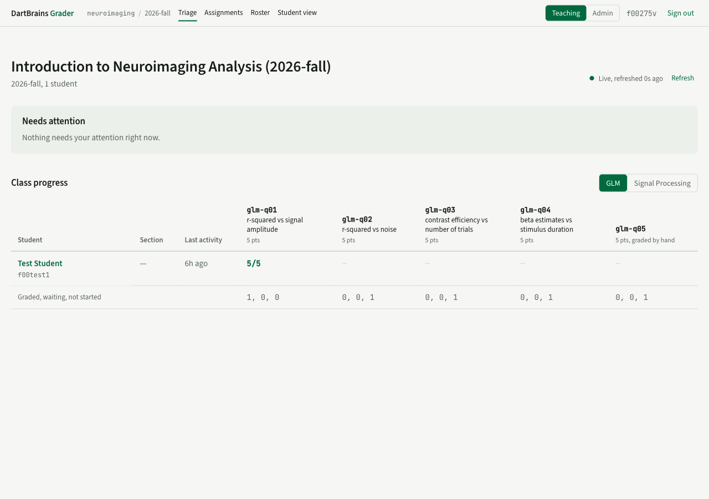
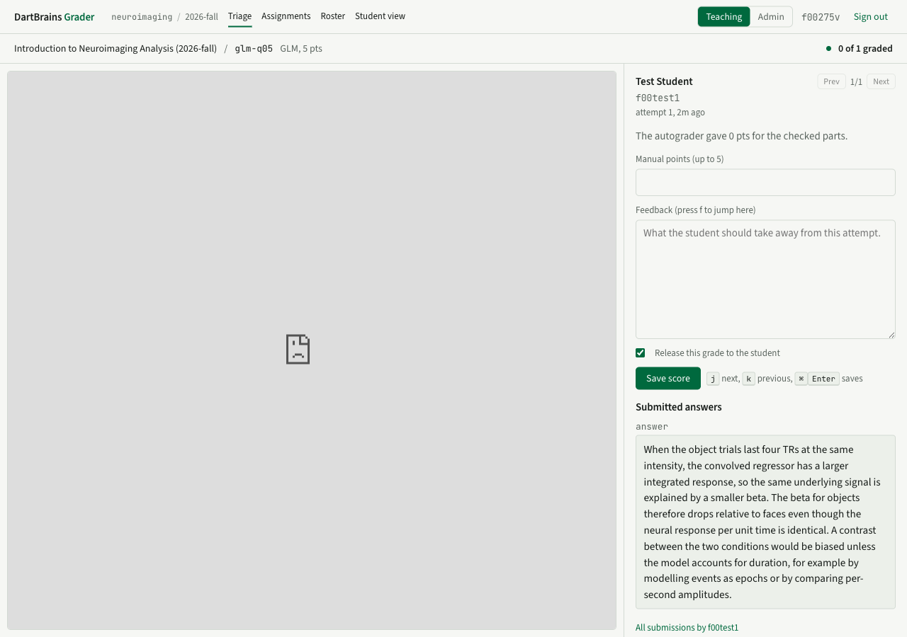

# Grading

For instructors and TAs. Where to look, what to grade, and how scores become grades.

## The course page

The course page answers one question first: who needs my attention? A list at the top shows only the items that need a person:

The screenshot shows a course with one assignment open and nothing waiting: the attention list collapses to a single line and the grid carries the detail.

- submissions waiting for a grade, per question, with a **Grade now** button;
- students with no activity for a week while an assignment is open;
- checks that more than a third of the class has been failing in the last two days;
- submissions the autograder could not run, with a **Retry** button.

When there is nothing, it says so in one line.

Below it, **Class progress** is a grid of students by question for the selected assignment. A cell shows the points earned, *waiting* for an ungraded submission, *failed* for a grading failure, or a dash. The footer tallies each column. Clicking a student opens their attempt history; clicking a hand-graded question's header opens its queue. The page updates itself as submissions arrive.

## The grading queue

Each hand-graded or hybrid question has a queue: one entry per student, showing their latest attempt, ungraded ones first and oldest first.

The rendered notebook fills the left pane; the right pane holds the score, the feedback box, and any written answers the student submitted.

The left pane is the student's notebook, rendered by the grader after execution, with the outputs they saw. Written answers submitted through a text box appear in the right pane under **Submitted answers**. Student code never runs in your browser.

The right pane holds the score. If the question has a rubric, each item has its own points and the total sums them; you can override the total. Feedback is a free text box the student sees.

/// admonition | "Release this grade to the student" does not withhold it
    type: warning

The checkbox is on by default. Unticking it marks the score **provisional**, not private: the student portal still shows the points and the feedback, and the notebook adds *Provisional score; a final grade may follow.*

So an unreleased score is a score the student can see and you have said you may change — not a draft they cannot. If you need marks to stay invisible until the whole class is graded, do not save them yet.
///

Keyboard: `j` and `k` move between students, `f` jumps to the feedback box, and `Cmd+Enter` (or `Ctrl+Enter`) saves. New submissions that arrive while you grade are added to the end of the queue without moving you.

Staff can submit to their own offering, so an instructor's test submissions appear here too — that is the intended way to rehearse an assignment before releasing it.

## How a score becomes a grade

Every save creates a new score record; nothing is overwritten, and each save is in the change log with who, when, before, after, and an optional reason.

The grade for a question is derived from the assignment's grade policy over the student's attempts:

| Policy | Counts |
|---|---|
| `latest` (default) | the most recent attempt |
| `highest` | the attempt with the highest total |
| `first` | the first attempt |
| `selected` | the attempt an instructor pins on the student's history page |

Autograded points and hand-entered points add up to the question's total. An assignment's grade is the sum of its questions.

## Retrying failed grading

If the autograder could not run a submission (a timeout, a package the sandbox could not build, a crash), the course page lists it under grader failures with the error. **Retry** re-queues it. If it fails again the error message is the place to start; the operator can read the full log on the server.

## Attempt limits and regrading

`attempts_allowed` on the assignment caps attempts per question; the widget tells students when they have used them. Republishing an assignment does not regrade old submissions; they stay bound to the version they were made against.
