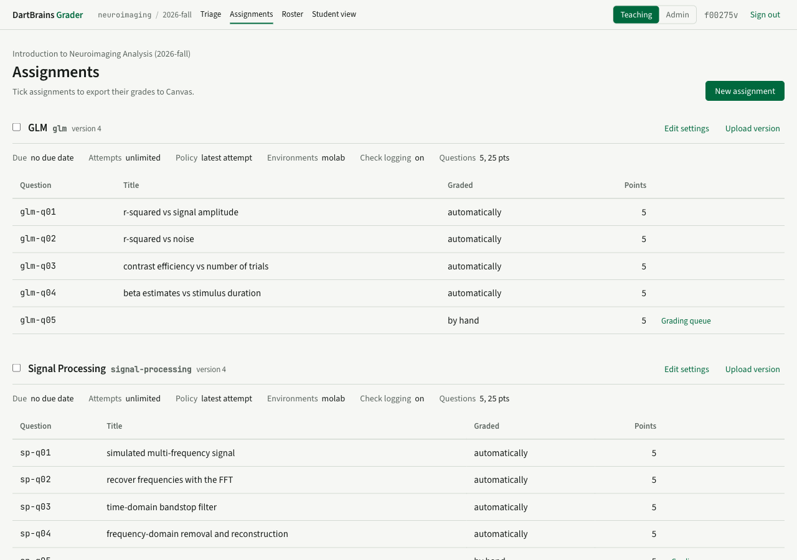

# Publish

For instructors. Publishing turns an instructor notebook into a versioned assignment on the grader and produces the student notebook to distribute.

## The command

From the grader's `backend` directory, or anywhere the `grader` command is installed:

```bash
uv run grader publish assignments/glm.py \
    --server https://grader.dartbrains.org \
    --offering neuroimaging/2026-fall \
    --slug glm --title "GLM"
```

- `--offering` is the course slug and term, `course/term`. The offering must exist (an administrator creates it) and you must be one of its instructors.
- `--slug` names the assignment inside the offering. Reuse the same slug to publish a new version.
- `--manual qid` and `--hybrid qid=auto_points` override the grading mode for a question.
- `--token` skips interactive sign-in; see [Single sign-on](../operators/single-sign-on.md) for when you would need one.

Without `--token`, the command opens your browser for the same sign-in handshake students use.

## What publishing does

1. Validates the markers, strips solutions and hidden tests, and refuses to continue if any marker survives.
2. Reads the marks cell and the check labels to build the question list: id, title, points, grading mode.
3. Uploads the instructor notebook and the stripped student notebook to the grader.
4. The grader finalizes the student notebook: it writes the assignment's identity into the PEP 723 block (server, course, term, slug, ids, version) and stores exactly those bytes as **version N**.
5. The command downloads the finalized notebook and writes `glm_student.py` next to your source. That file is what you distribute.

The published student notebook is also served at a stable address, `https://<server>/a/<course>/<term>/<slug>/student.py`, and `.../molab` opens it in MoLab directly.

## Versions

A version is immutable. Every submission records which version the student opened, and it is graded against that version's instructor notebook, hidden tests included, forever. Republishing creates version N+1; students who already opened version N keep working and submitting, and they see a note that a newer version exists.

Two things do not create a version: publishing identical content (the grader answers *unchanged*), and changing question titles, which update in place.

Removing a question in a new version does not break older copies: submissions from version N for that question are still accepted and graded.

## Keeping the course website in step

If your course site shows the student notebook (DartBrains commits the file into its repository so the site's MoLab button works), republish means: run `grader publish`, copy the new `_student.py` into the site, and deploy the site. A `sync-assignments` command for marimo-book that does this automatically is planned.

## Assignment settings

Settings live on the grader, not in the notebook, so they change without republishing. Edit them on the Assignments page or through the API:



| Setting | Meaning | Default |
|---|---|---|
| `due_at` | Shown to students; not enforced yet | none |
| `attempts_allowed` | Maximum attempts per question, or unlimited | unlimited |
| `grade_policy` | Which attempt counts: `latest`, `highest`, `first`, `selected` | `latest` |
| `environments` | Which launch buttons the course site shows | `["molab"]` |
| `log_checks` | Record Check results for the class-wide failing-check view | on |
| `canvas_assignment_id` | Column id for [Canvas export](canvas-export.md) | none |
| `required_datasets` | Datasets the operator pre-caches for the sandbox | none |
