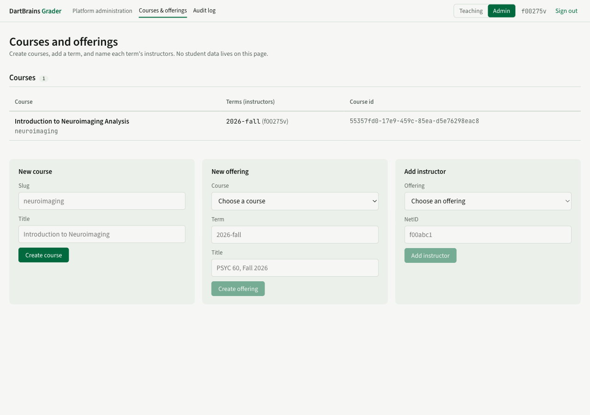

# Deploy

The runbook, end to end. It is written against DigitalOcean because that is what the reference deployment uses, but nothing here is specific to it: any Ubuntu host with Docker and any PostgreSQL 16 will do, and the only DigitalOcean-flavoured steps are the ones about creating the machine and the database.

Read [Overview](overview.md) first if you have not.

Allow an hour for a first deploy, most of it waiting for DNS and for a database to provision.

## 1. Create the infrastructure

**The host.** Ubuntu 24.04 LTS, 2 vCPU / 4 GB, SSH key authentication only, in a region near your users. If you are using DigitalOcean: a Premium Intel or AMD droplet, in the default VPC for the region, monitoring enabled, tagged `grader`.

**A firewall.** Inbound SSH from your own addresses, HTTP 80 and HTTPS 443 (TCP and UDP) from anywhere, all outbound. The host also runs `ufw`; the cloud firewall is the outer layer.

**PostgreSQL 16.** Managed, smallest plan, **same region and private network as the host**, with the host as its only trusted source. Create a database and user both called `grader`, then take the *private network* connection string. It looks like:

```
postgresql://grader:<password>@private-db-…ondigitalocean.com:25060/grader?sslmode=require
```

The application uses psycopg, so the value in `.env` is that string with the scheme changed to `postgresql+psycopg://`. Keep `?sslmode=require` — a managed cluster refuses unencrypted connections, and you want it to.

**DNS.** An A record for the hostname pointing at the host's public IPv4. Caddy obtains a Let's Encrypt certificate on first start, so this must resolve *before* the first deploy or the certificate request fails and you wait out a rate limit.

## 2. Bootstrap the host

From your laptop, with the repository checked out:

```bash
ssh root@<host-ip> 'bash -s' < deploy/bootstrap.sh
```

That installs Docker, creates a `deploy` user with the docker group and root's SSH keys, enables unattended security upgrades, opens 22/80/443 in `ufw`, starts fail2ban, creates `/srv/grader`, and permits the unprivileged user namespaces the grading sandbox needs. It is safe to re-run.

Then let the host pull the images. If the packages are public, skip this; otherwise create a classic personal access token with only the `read:packages` scope and:

```bash
ssh deploy@<host-ip>
echo '<token>' | docker login ghcr.io -u <github-username> --password-stdin
```

## 3. Write `.env`

In `/srv/grader`, mode 600. Start from [`.env.example`](https://github.com/ljchang/marimo-grader/blob/main/.env.example); [Configuration](../reference/configuration.md) is the full list. With `GRADER_ENV=prod` the service refuses to start if a required secret is missing — that refusal is the point, so do not work around it.

### Generate the secrets

```bash
# Session cookie signing secret
python3 -c "import secrets; print(secrets.token_urlsafe(48))"

# Ed25519 key for notebook tokens (run inside the image, which has the dependencies)
docker run --rm ghcr.io/ljchang/marimo-grader-backend:main \
  python -c "from grader.auth.tokens import generate_private_key_pem as g; print(g())"

# SAML service-provider certificate and key, 10 years, self-signed
openssl req -x509 -newkey rsa:2048 -nodes -days 3650 \
  -keyout sp.key -out sp.crt -subj "/CN=grader.example.edu"
```

Multi-line PEM values go into `.env` on one line with `\n` separators — pydantic-settings unescapes them inside double quotes:

```bash
printf 'GRADER_SAML_SP_KEY="%s"\n' "$(awk 'NF {printf "%s\\n", $0}' sp.key)"
```

Delete `sp.key` from your laptop once it is in `.env`, and put a copy of `.env` in a password manager — it is the only copy of both keys.

### The values that matter

| Variable | Set to |
|---|---|
| `GRADER_ENV` | `prod` |
| `GRADER_HOST` | the hostname Caddy serves and gets a certificate for |
| `GRADER_BASE_URL`, `GRADER_FRONTEND_URL` | `https://<hostname>` — both, in a single-host deployment |
| `GRADER_DATABASE_URL` | the private connection string, `postgresql+psycopg://…?sslmode=require` |
| `GRADER_SESSION_SECRET` | generated above; **stable across deploys** or everyone is signed out |
| `GRADER_COOKIE_SECURE` | `true` |
| `GRADER_JWT_PRIVATE_KEY_PEM` | generated above |
| `GRADER_AUTH_MODE` | `saml`, or `disabled` until registration completes |
| `GRADER_SAML_*` | see [SAML](../auth/saml.md) |
| `GRADER_CORS_ORIGINS` | every origin a notebook will run on: your course site, `https://molab.marimo.io` |
| `GRADER_IMAGE_TAG` | `main`, or pin a release |

`GRADER_ARTIFACT_DIR` is set by the image; leave it out.

/// admonition | The setting people forget
    type: tip

`GRADER_CORS_ORIGINS`. It is not needed to deploy, and not needed to sign in to the web app, so an omission surfaces only when a student presses Submit from the course website and is told the grader could not be reached. Add the origins when you set up, not when someone reports it.
///

## 4. Deploy

```bash
scp docker-compose.prod.yml deploy/deploy.sh .env deploy@<host-ip>:/srv/grader/
ssh deploy@<host-ip> 'chmod 600 /srv/grader/.env && cd /srv/grader && ./deploy.sh'
```

`deploy.sh` pulls both images at `GRADER_IMAGE_TAG`, fixes volume ownership for the non-root container user, runs the migration (a failure here stops the deploy before anything else changes), starts `web`, `worker` and `proxy`, waits for the health check, prunes old images, and prints `docker compose ps`.

## 5. Verify

```bash
curl -fsS https://<hostname>/api/health
# {"ok":true,"env":"prod","auth_mode":"saml"}

curl -sI https://<hostname>/ | grep -iE 'strict-transport|content-security|x-robots'

curl -fsS https://<hostname>/api/v1/auth/saml/metadata | head -3
```

Then check the sandbox, which is the one thing that fails silently later if it is wrong:

```bash
cd /srv/grader
docker compose -f docker-compose.prod.yml exec worker \
  bwrap --ro-bind / / --unshare-all --dev /dev --proc /proc -- /bin/true && echo sandbox ok
```

If that reports *No permissions to create new namespace*, see [Sandbox and data](sandbox-and-data.md).

## 6. The first course

Sign in as yourself — through SAML if it is registered, otherwise with a one-time link:

```bash
docker compose -f docker-compose.prod.yml run --rm web grader login-link <netid>
```

Switch to **Admin** mode and create the first course, its offering, and its instructor. Everything on this screen is platform-level: no student data appears here, and an administrator cannot read any.



Or do it from the command line, which is also how you get going before sign-in is available:

```bash
docker compose -f docker-compose.prod.yml run --rm web grader seed \
    --course neuroimaging --title "Introduction to Neuroimaging Analysis" \
    --term 2026-fall --instructor <netid> --students

docker compose -f docker-compose.prod.yml run --rm web grader token <netid> \
    --offering neuroimaging/2026-fall --role instructor --admin
```

The trailing `--students` with nothing after it matters: `seed` defaults to two example students, and an empty list is how you say *no students* on a real server. Real ones arrive by [roster import](../instructors/roster-and-staff.md).

That token is valid eight hours and lets an instructor publish from their laptop without a browser:

```bash
uv run grader publish assignments/glm.py \
    --server https://<hostname> --offering neuroimaging/2026-fall \
    --slug glm --title "GLM" --token <token>
```

## 7. Before students arrive

- [Warm the dataset cache](sandbox-and-data.md#the-dataset-cache) if any assignment reads data. Skipping this does not produce zeros; it produces grader failures.
- Import the roster, which also sets up [Canvas export](../instructors/canvas-export.md).
- Set up [backups](backups-and-upgrades.md) and test a restore once.
- Submit one assignment yourself, end to end, as a student would. Staff can submit precisely so that this is possible.

## Redeploying

```bash
ssh deploy@<host> 'cd /srv/grader && ./deploy.sh'              # latest main
ssh deploy@<host> 'cd /srv/grader && ./deploy.sh sha-1a2b3c4'  # a specific commit
ssh deploy@<host> 'cd /srv/grader && ./deploy.sh v0.2.0'       # a release tag
```

A tag passed this way applies to that run only; put it in `.env` to make it stick. Rolling back is the same command with an older tag — but migrations are forward-only, so roll back the application, not the schema, unless you have checked that the migration in between is reversible.

Prefer deploying between assignment deadlines. Nothing about a deploy affects open student notebooks, but a restart during a submission spike is needless drama.

## Useful commands

```bash
docker compose -f docker-compose.prod.yml logs -f web worker proxy
docker compose -f docker-compose.prod.yml run --rm web grader --help
docker compose -f docker-compose.prod.yml exec web \
  python -c "from grader.config import get_settings; print(get_settings().env)"
```

## Hotfixing without CI

The host never builds. If you must ship something CI cannot:

```bash
docker build -t ghcr.io/ljchang/marimo-grader-backend:hotfix backend
docker build -t ghcr.io/ljchang/marimo-grader-web:hotfix -f deploy/web/Dockerfile .
docker push … && ./deploy.sh hotfix
```

Then get the change onto `main` and redeploy from a real build, so the next person does not inherit a mystery tag.
