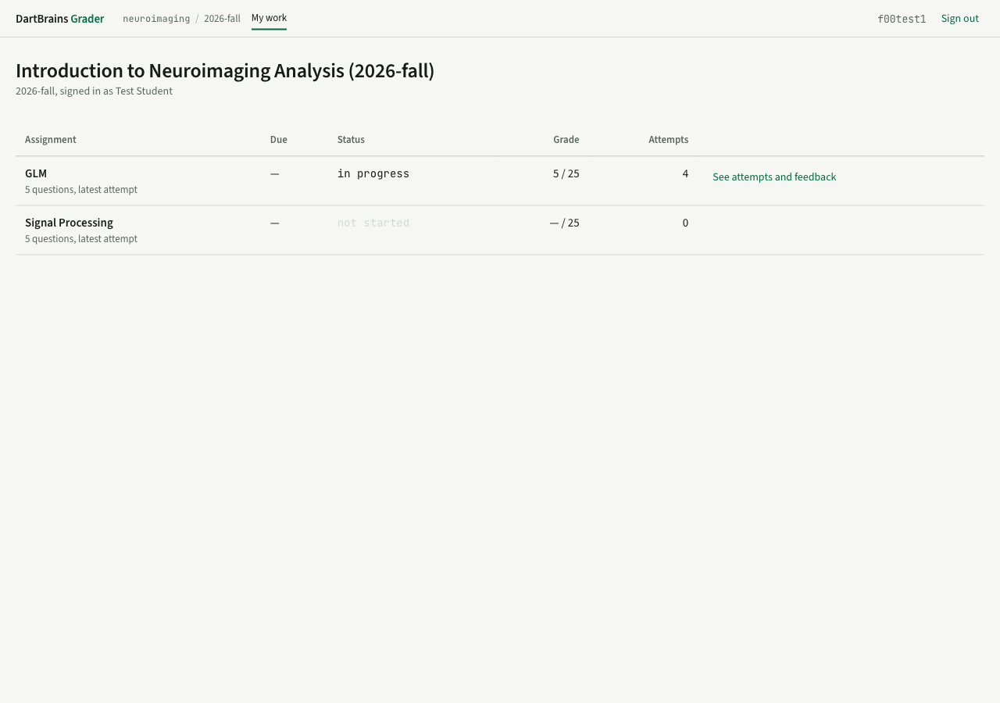

# Feedback and grades

For students. Where to see what you got, and what each state means.

## Two places, same data

**In the notebook.** After you submit, the feedback panel under that question fills in: the score, which conditions passed, and the message for each one that did not. This is the fast loop — submit, read, fix, submit again if attempts allow.

**On the grader's website.** Sign in there and you get everything: every assignment, every attempt, every score and comment.

This is the one that matters at the end of term. A MoLab session can be deleted, a laptop can die, a browser can be cleared — the grader still has every notebook you submitted and every score it earned.

## What the states mean

| You see | It means |
|---|---|
| A score | graded, and released to you |
| *waiting for grade* | submitted; a person has not read it yet |
| *grading* | the automatic run is still going, normally under a minute |
| *failed* | the grader could **not run** your notebook. Not a zero — a problem for your instructor, who has a Retry button |
| A dash | nothing submitted for that question |

A score your instructor saved without releasing still reaches you: the portal shows it like any other, and the notebook labels it *Provisional score; a final grade may follow.* Treat a provisional mark as exactly that — it can change before it is finalised.

## Reading autograded feedback

Each condition your instructor wrote has a message and a weight. Feedback lists the ones that failed with their messages, so a partly-right answer gets partial credit and a specific complaint rather than a bare number.

A failed condition you never saw in Check is a [hidden test](sign-in-and-submit.md#hidden-tests).

If the feedback says your check cells were restored before grading, it means the cells containing the tests differ from the published assignment — usually an accidental edit while working near them. The instructor's versions are used, so this costs you nothing by itself.

## Which attempt counts

Whichever your instructor's policy says: the latest, the highest, the first, or one they pinned. The assignment page tells you which. Every attempt is kept and visible either way, so a bad last attempt is only bad if the policy is `latest` — and you can usually submit again.

An assignment's grade is the sum of its questions.

## If you think a grade is wrong

Ask your instructor. Two things are worth knowing before you do.

Every score has a history: who set it, when, what it was before, and any reason given. So "this changed and I do not know why" is an answerable question, not a matter of memory.

And your submitted notebook is on the server exactly as you sent it. A regrade needs nothing from you — you do not need to keep a copy, re-upload anything, or prove what you submitted.
