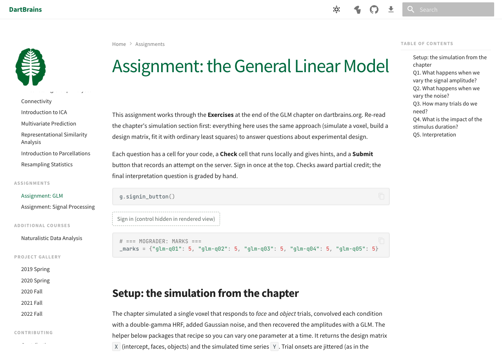

# Open an assignment

For students. This page covers getting a notebook open; [Sign in and submit](sign-in-and-submit.md) covers the rest.

Assignments are marimo notebooks. Your course site lists them — on DartBrains, under **Assignments** — and each assignment page shows the notebook with buttons for the ways you can run it. Your instructor decides which buttons appear.

/// admonition | Not sure what any of this looks like?
    type: tip

There is a [demo assignment](../demo/try-an-assignment.md) on this site that opens in your browser. Nothing to install, nothing submitted.
///

## Open in MoLab

The usual choice. MoLab is marimo's hosted notebook service: a full Python environment in a browser tab, nothing to install.

1. Click **Open in molab** on the assignment page.
2. Sign in to MoLab if asked. MoLab needs its own account — GitHub or Google — and this is **separate** from your university sign-in, which happens later, inside the notebook.
3. Wait for the environment to build. The first open of an assignment installs its packages, which can take a minute; later opens are faster.

MoLab keeps your notebook between sessions under your account. If you want a fresh copy, open the assignment page again — but see [Starting over](#starting-over) first.

## Run in the browser

Some assignments run entirely in the page, with no server at all. If the assignment page shows the notebook already running — sliders move, cells execute — you can work there directly. Everything else applies: Check, sign in, Submit.

Work in a browser-run page lives in that browser. It survives closing the tab, but it is not in your account and it is not on another machine, so download a copy if the work matters to you.

## Open on the cluster

If your course uses an institutional cluster — at Dartmouth, Discovery through Open OnDemand — the assignment page shows **Open on Discovery**. It launches marimo on the cluster with the notebook in your home directory. Ask your course staff for cluster access first; it is not automatic.

Submitting works from there exactly as it does anywhere else, even from behind the VPN: the submit button runs in your browser, not on the cluster.

## Work on your own computer

Click **Download**, then, with [uv](https://docs.astral.sh/uv/) installed:

```bash
uv run marimo edit --sandbox glm_student.py
```

`--sandbox` reads the dependency list inside the notebook and builds an environment for it, so the notebook runs the same way it does in MoLab. You do not have to install anything else, and you should not edit the dependency list.

## What you should see

Whichever way you opened it, the notebook has the same shape:



- an introduction and a **Sign in** button near the top;
- one section per question, each with a place for your work, a **Check** cell that runs instantly, and a **Submit** button;
- written questions have a text box instead of code.

If a cell says *Complete the code cell above first*, that is the check waiting for your answer, not an error. If a cell shows a `# HIDDEN TESTS` comment, that is deliberate too — see [Sign in and submit](sign-in-and-submit.md#hidden-tests).

## Starting over

Opening the assignment page again gives you a fresh copy of the notebook. It does **not** give you your work back, and it does not take anything away from the grader: everything you have already submitted is stored there, with its score, whatever happens to the copy you are working in.

So: starting over is safe, and losing your working copy is annoying rather than fatal.

## Which copy am I supposed to use?

The one from your course page. A notebook carries, inside itself, which assignment and which version it is — a copy from a friend, from last term, or from a different course will submit against whatever *it* says it is. If Submit ever reports an assignment you did not expect, that is why.
